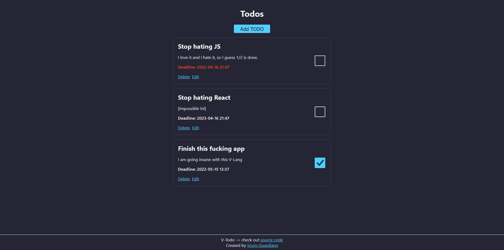

# V-Todo - Full stack todo app written in V
It's simple todo app written with V-lang on backend and Next.js on frontend. The code is very ugly though.

V-lang seems pretty nice yet a lot of things are missing. But I think in the future this will be very good go alternative. Give it a try if you want! Here is simple fullstack application, using [VEX](https://github.com/nedpals/vex) as HTTP Server framework and V native ORM to interact with sqlite database. This is just very young language and already got over 28k stars on github. Read more here: [https://vlang.io](https://vlang.io).

I used VEX as framework instead of V native HTTP framework, coz it feels like express. Unfortunately it's very basic.

It was a little bit pain in ass coding this backend, VEX is very basic, native V ORM is very basic, V doesn't support optionals on structs yet. But ya know, as I said it's very young language and still in development ^^

# Running it
## Open it in gitpod
It's the easiest way, click the button, wait for everything to get installed and be happy.  

## Run on your Linux machine
It's masochistic, you don't want to do that, just open on gitpod.
1. Install V from vlang -> [https://vlang.io](https://vlang.io)
2. Install node and npm -> [https://nodejs.org](https://nodejs.org)
3. Run `v install` to install backend dependencies
4. Install sqlite.
5. Run `./build.sh` or `v -cc gcc -gc boehm .` to compile V code to executable.
6. Run `./v-todo` to start backend.
7. Cd into frontend `cd app` and install dependencies `npm install`
8. Run `npm run dev` to start frontend
9. Go to `localhost:3000` and be happy.

## Run on your Windows machine
1. Just don't.

# Some cool screen

# LICENSE
WTFPLv2  
Check LICENSE file.
